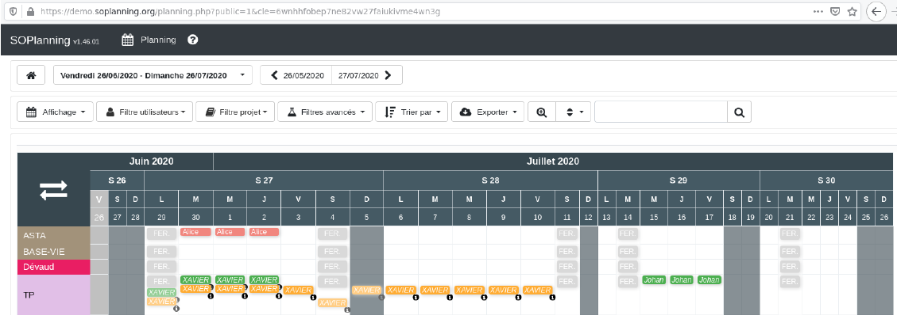
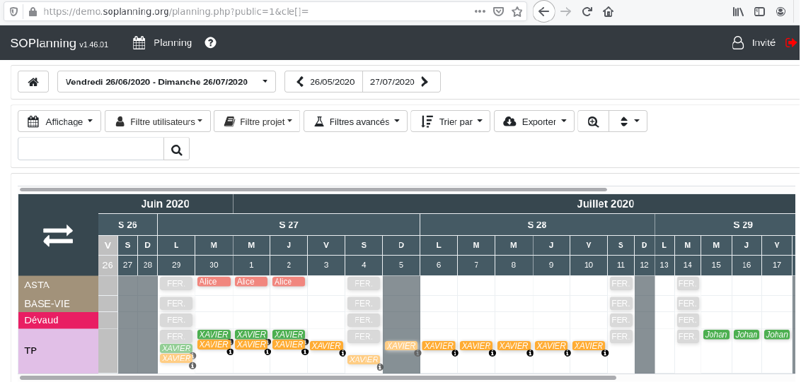

# SoPlanning Sharing Key Bypass

## Informations

- Vulnerable Version : 1.46.01
- Fixed Version : 1.47 and above

## Timeline

- 26/06/2020 : This vulnerability report was sent to the vendor
- 21/07/2020 : The vulnerability is fixed

## Risks

The sharing key system is vulnerable to PHP Type Juggling attack, which allows an attacker to access the content of the calendar without knowing the sharing key.

## Requirements

To be vulnerable, the calendar sharing key must be enabled.


Once this sharing is enabled, a user can access calendar without authentication by using the sharing key.



Of course, if the key is false, the access is denied.

## Exploitation

The key validation is in the file "**includes/header.inc**"

```php
if ( CONFIG_SOPLANNING_OPTION_ACCES == 2 && isset($_GET['public']) && isset($_GET['cle']))
{
  if (strcmp($_GET['cle'],CONFIG_SECURE_KEY)==0)
  {
    $_SESSION['public']=1;
    $_SESSION['user_id']='publicspl';
  }
}
```

The **strcmp** function is used with a non strict comparaison. The result of this comparaison depend on the following : [PHP type comparison tables](https://www.php.net/manual/en/types.comparisons.php)

The result of the **strcmp** function is describe in the documentation : [strcmp]'https://www.php.net/manual/en/function.strcmp.php)

> Returns < 0 if str1 is less than str2; > 0 if str1 is greater than str2, and 0 if they are equal. 

This function return "**NULL**" if one of parameters is an array.

Following the [PHP type comparison tables](https://www.php.net/manual/en/types.comparisons.php), the non strict comparaison between "**NULL**" and 0 is **true**

Thus, if **$\_GET['cle']** is an array, the condition result is **true** and the access is autorized

This link will define **$\_GET['cle']** as an array :
[https://demo.soplanning.org/planning.php?public=1&cle[]=](https://demo.soplanning.org/planning.php?public=1&cle[]=)



The access is granted as "**Invité**"

## Fix

To fixed this vulnerability, a strict comparaison can be used:

```php
if ( CONFIG_SOPLANNING_OPTION_ACCES == 2 && isset($_GET['public']) && isset($_GET['cle']))
{
  if (strcmp($_GET['cle'],CONFIG_SECURE_KEY)===0)
  {
    $_SESSION['public']=1;
    $_SESSION['user_id']='publicspl';
  }
}
```
Or the comparaison can be done without the **strcmp** function.

```php
if ( CONFIG_SOPLANNING_OPTION_ACCES == 2 && isset($_GET['public']) && isset($_GET['cle']))
{
  if ($_GET['cle'] === CONFIG_SECURE_KEY)
  {
    $_SESSION['public']=1;
    $_SESSION['user_id']='publicspl';
  }
}
```
